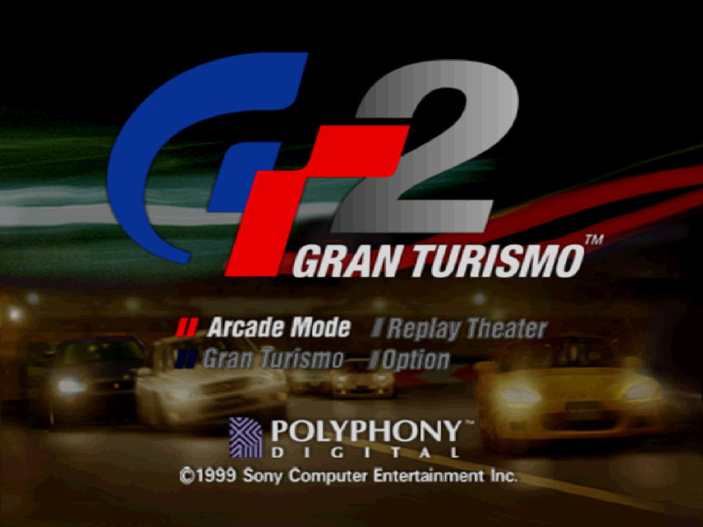
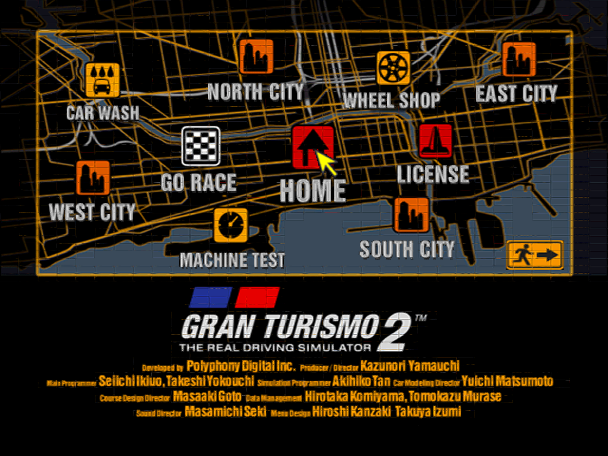
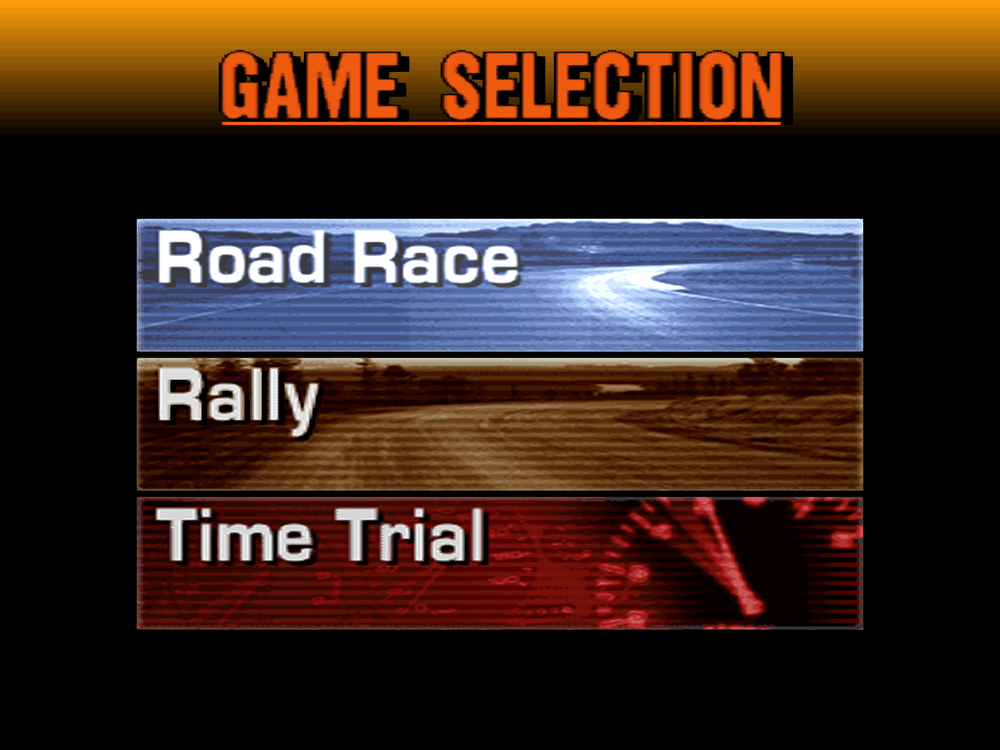
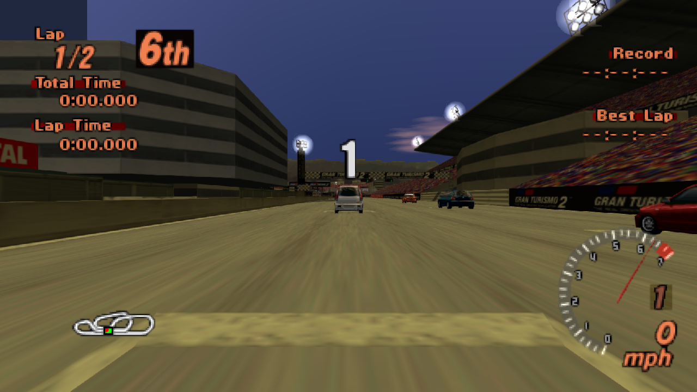
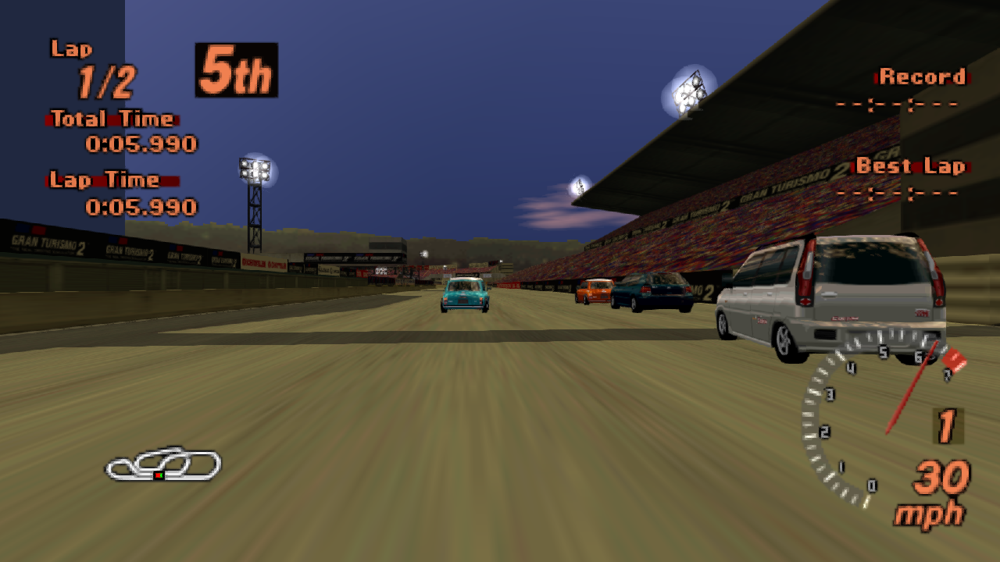

# OpenGTPS1

OpenGTPS1 0.9b is an experimental static-recompilation port of the US
Gran Turismo 2 **Simulation Disc** (`SCUS-94488`, NTSC-U revision 2) and
**Arcade Disc** (`SCUS-94455`, NTSC-U), built with
[RecompOne](vendor/RecompOne/UPSTREAM.md).

The project currently targets Windows x64. It boots through the original game
flow, renders menus and videos, supports controllers and memory cards, and can
run a purchased and upgraded car through complete races, championships, and
replays. Its portable native race/replay renderer is designed to support both
modern PCs and, in a future port, the original Xbox through
[NXDK](https://github.com/XboxDev/nxdk).

> [!IMPORTANT]
> **0.9b needs broad community testing.** Please play both modes, try your
> controllers and existing saves, and report crashes, visual defects, audio
> problems, and performance regressions through the
> **[public issue tracker](https://github.com/GTTeancum/OpenGTPS1/issues)**.
> Use **[New issue](https://github.com/GTTeancum/OpenGTPS1/issues/new)** to
> include your hardware, reproduction steps, and
> `logs\OpenGTPS1-latest.log`.

> [!IMPORTANT]
> This repository contains no Gran Turismo 2 disc data, Sony BIOS, music, save
> files, or other copyrighted game assets. You must supply your own matching
> disc. Do not open an issue asking for game files.

<p align="center">
  
</p>

<p align="center"><em>The unified main menu launches Arcade Mode, Gran Turismo Mode, Replay Theater, and options from one executable.</em></p>

## Project status

OpenGTPS1 0.9b is playable on Windows x64, but it is not a finished 1.0
release. Active development is entering a hiatus; testing and detailed issue
reports are especially valuable while work is paused.

- The unified Windows port boots the original GT2 opening and offers native
  Arcade Mode and Gran Turismo Mode from one title menu.
- Complete races, championships, results, and native replays are playable.
- Menus, videos, input, memory-card persistence, sound effects, and XA audio
  are implemented.
- Valid Simulation saves are loaded before the unified title, and their full
  native payload—including credits, licenses, garage, current car, and
  records—follows the handoff into Arcade Mode's Home Garage.
- The distributable runtime uses loose files only; it never needs a mounted or
  adjacent BIN/CUE/CCD/IMG/SUB image after preparation.
- External OGG music, fixed modern graphics settings, structured logging, and
  a deterministic AI-driven test harness are available.
- The packaged native race/replay renderer uses perspective-correct resident
  course geometry, exact road-seam handling, extended draw distance, maximum
  vehicle LOD, and geometry-aware 59.94/60 Hz presentation. Provenance-backed 3D never
  reaches a PS1-era compatibility rasterizer. GT2's authored screen-command
  compositor remains in use for menus, videos, HUD layers, Results, and
  world-free transitions; it is the 2D layer of the modern presentation path,
  not a selectable legacy 3D renderer.
- True horizontal-plus widescreen and the fixed authored-world renderer are
  implemented, but visual defects and hardware-specific problems may remain.
- Original Xbox support has not landed yet.

## Screenshots

| Gran Turismo Mode | Arcade Mode |
| --- | --- |
|  |  |
| Red Rock Valley starting grid | Red Rock Valley race |
|  |  |

## Open issues and testing priorities

The current known defects are tracked in [`TO-DO.MD`](TO-DO.MD):

- The generated prize/LM development smoke-test save gives some cars incorrect
  wheel widths.
- At least the black JGTC Castrol Supra can revert to white when a race begins.
- The planned original-Xbox port has not been implemented.

The 0.9b Windows release needs user testing across more hardware and ordinary
play patterns. The highest-value reports cover:

- fresh setup with the exact supported two-disc set;
- Xbox-compatible controllers and keyboard input from the first title-menu
  press through full races;
- creating, loading, updating, and backing up memory cards, including Arcade
  Home Garage use;
- full races and replays on every course, with attention to starting grids,
  vehicle reflections, flicker, seams, pop-in, and paint/livery persistence;
- sustained performance, especially cases that fall materially below the
  intended roughly 55–60 FPS range;
- XA music, sound effects, external OGG playback, and device-specific audio
  behavior.

Please search the **[open issues](https://github.com/GTTeancum/OpenGTPS1/issues)**
before filing, then use **[New issue](https://github.com/GTTeancum/OpenGTPS1/issues/new)**
and attach the latest bounded log whenever possible.

[`TO-DO.MD`](TO-DO.MD) is the detailed implementation and validation record.
[`docs/PORT_PLAN.md`](docs/PORT_PLAN.md) documents the playable vertical slice
and the RecompOne-specific discoveries behind it. The
[`modern renderer architecture`](docs/MODERN_RENDERER.md) defines the shared PC
and original-Xbox direction.

## Unified installation and GT1 conversion status

The 0.9b release includes a self-contained two-disc preparation tool. It
validates the exact supported GT2 Simulation and Arcade raw IMG files,
extracts only the required native data, and creates the unified loose
installation. It never copies or retains either source image.

The repository also contains substantial Gran Turismo 1 conversion and
validation work, including Special Stage Route 11, native car/body conversion,
and paint/livery folding. That development pipeline requires the user's own
matching GT1 disc and remains source-side work; the public 0.9b installer does
not distribute or generate proprietary GT1 content.

The development conversion pipeline now validates the US Gran Turismo image
and imports Special Stage Route 11, all three GT1-exclusive EUNOS ROADSTER
Arcade families, and the GT1 Civic Racer as native GT2 data. It converts all
six Route 11 variants and
the authored
`dawn3` background, preserves the exact `ARCADE.DAT` entry 81 selection art,
and adds the Roadsters as the tenth through twelfth Class C entries with their
original wordmarks and all twenty-three authored GT1 paint/livery palettes.
The third entry is the six-palette 145 PS `EUNOS ROADSTER RS`, whose separate
GT1 day/night models are structurally converted to native GT2 CDO/CNO data
without substituting GT2 body geometry. The Civic Racer is a native tenth
Class B entry with its unique body and all three turquoise, pink, and yellow
GT1 liveries. The GT1 DB7 Coupe is a native ninth Class A entry with its exact
selection artwork and all three white, burgundy, and deep-purple paints. The
GT1 Impreza WRX-STi Version III is a native tenth Class A entry with its unique
converted body and all three liveries. The GT1 Soarer 2.5GT-T VVT-i is the
eleventh Class A entry with its exact selection artwork, unique converted
day/night body, and all three wine-red, yellow, and purple palettes. The GT1
Supra RZ is the twelfth Class A entry with its exact selection artwork and
three turquoise, purple, and bronze GT1 liveries. The GT1 S13 Silvia Q's
1800cc is a native thirteenth Class C entry with its original named menu
artwork and three wine-red, yellow, and green palettes. The GT1 Lancer
Evolution IV GSR is the thirteenth Class A entry with its exact named logo and
yellow, teal, and purple palettes. The GT1 Alcyone SVX S4 is the eleventh
Class B entry with its exact named logo and white, blue, and purple palettes.
The GT1 Celica SS-II is the twelfth Class B entry with its exact named menu
art, structurally converted body/UV data, teal, purple, and yellow palettes,
and target-owned 1,220 kg chassis record.
The GT1 Civic CR-X '91 Si is the thirteenth Class B entry with its exact named
Honda/CR-X art, structurally converted UV-preserving body, black, yellow, and
purple palettes, and target-owned 970 kg chassis record.
The deterministic
`GTPATCH.VOL` also carries sorted native Racing and Drift parameter records
assembled from the matching GT2 V-Special chassis/suspension, S-Special
wheel/tire package, GT1-equivalent Mazda brake conversion, and direct Roadster
RS, Civic, DB7, Impreza, Soarer, Supra, Silvia, Lancer, Alcyone, Celica, and
CR-X specifications. Menu-to-race smokes have run the track and all thirteen
cars under GT2's native AI controller
without an
unmapped call, managed exception, or software fault. Remaining exclusive cars
and livery families are the next content milestone.

## Install the 0.9b Windows release

The prebuilt release requires:

- Windows 10 or 11, x64
- PowerShell
- Your own supported US Gran Turismo 2 **Simulation Disc**, revision 2
- Your own supported US Gran Turismo 2 **Arcade Disc**

Other regions and revisions are not supported. The required raw Mode 2/2352
images are:

```text
Serial:  SCUS-94488
Size:    691,850,208 bytes
SHA-256: D0AB6E70539601057590A36299543C0ADAD219254D712F7D4273219094ED5031

Serial:  SCUS-94455
Size:    729,423,408 bytes
SHA-256: C2E97D6B0C847CA4336D9D84D8D98C349D1240ED075E81AB3FD5C977E9A45075
```

The release contains no game data. To install:

1. Download `OpenGTPS1-0.9b-win-x64.zip` from the GitHub release.
2. Extract the entire `OpenGTPS1-0.9b-win-x64` folder to a writable
   location. Do not run it from inside the ZIP.
3. Rip both matching discs as raw Mode 2/2352 `.img` files.
4. Open PowerShell in the extracted folder and run:

   ```powershell
   powershell -ExecutionPolicy Bypass -File `
    .\Setup-From-GT2-Discs.ps1 `
    -SimulationImagePath "D:\Rips\GT2 Simulation.img" `
    -ArcadeImagePath "D:\Rips\GT2 Arcade.img"
   ```

5. When setup reports `Installation complete`, run `GranTurismo2PC.exe`.

Setup validates both complete disc hashes before writing anything, extracts
only the required loose runtime files beside the executable, and does not copy
or retain either IMG. The game creates blank `carda.sav` and `cardb.sav`
memory cards on first launch. The executable is self-contained; users do not
need Python, the .NET runtime/SDK, CMake, Visual Studio, or a PlayStation BIOS.

Keep the installation in a writable folder because saves, settings, and the
latest diagnostic log are stored beside the executable. Windows SmartScreen
may warn because this beta is not code-signed.

The ZIP also contains an installation-focused `README.md`. Existing users
should back up `carda.sav`, `cardb.sav`, and `settings.json` before replacing
an older build.

## Build requirements

Building from source additionally requires:

- Python 3
- .NET 10 SDK
- CMake and a Visual Studio C++ x64 toolchain

The archival inputs must use these exact names in the repository root:

```text
Gran Turismo 2 [Simulation Disc] [U] [SCUS-94488].cue
Gran Turismo 2 [Simulation Disc] [U] [SCUS-94488].img
SCUS_944.55.cue
SCUS_944.55.img
```

Other dump formats and game revisions are not currently supported. Disc files
and all extracted/generated data are excluded by `.gitignore`.

## Build from source

Clone the repository, place both matching CUE/IMG pairs in its root, and run:

```powershell
python tools\extract_disc.py
powershell -ExecutionPolicy Bypass -File tools\build.ps1 -Regenerate
```

Recompilation creates ignored developer output under `generated\`. Packaging
creates the one-folder installation under `OpenGTPS1\`:

```text
OpenGTPS1\
  GranTurismo2PC.exe
  interface.ini
  GT2.VOL
  manifests\
    arcade.json
    simulation.json
  arcade\
  simulation\
  music\
```

After the first regeneration, ordinary rebuilds do not read the archival disc
image:

```powershell
powershell -ExecutionPolicy Bypass -File tools\build.ps1
```

Run the packaged executable directly:

```powershell
OpenGTPS1\GranTurismo2PC.exe
```

Or launch the development build:

```powershell
powershell -ExecutionPolicy Bypass -File tools\run.ps1
```

## Controls

Xbox-compatible controllers map to the equivalent PlayStation controls.
Default keyboard bindings are:

| PlayStation control | Keyboard |
| --- | --- |
| D-pad | Arrow keys |
| Cross / accelerate | Z |
| Circle | X |
| Square / brake | A |
| Triangle | S |
| Start | Enter |
| Select | Right Shift |
| L1 / R1 | Q / W |
| L2 / R2 | E / R |

Bindings, display, audio, and graphics options are available in the wrapper
menus.

## Graphics

OpenGTPS1 has one modern 3D path. It always uses 4x source rendering,
perspective-correct resident-course texture mapping, stabilized authored topology, complete
authored draw distance, maximum track/scenery and vehicle LOD, smoothed
sampling, and no PS1 color dithering. Old `PS1 Quality`, `Custom`, stock-distance/LOD,
and native-renderer-disable configuration values are migrated to that fixed
contract and cannot reactivate a compatibility world renderer.

Output resolution, fullscreen/window state, and presentation antialiasing are
wrapper settings; they do not reduce world geometry or reinstate PS1 rendering.

## External music

Place OGG Vorbis files next to the executable:

```text
OpenGTPS1\music\[artist] - [song].ogg
```

Files are sorted into a looping queue. Artist and title labels are derived from
the filename. Sound effects and video XA audio remain independent.

## Diagnostics and safe automation

Each launch replaces:

```text
OpenGTPS1\logs\OpenGTPS1-latest.log
```

The log is capped at 4 MiB. Attach it when reporting graphics, frame-pacing,
audio, CD, or save problems.

Unattended runs must use:

```powershell
OpenGTPS1\GranTurismo2PC.exe --headless
```

Headless mode hides the window, forces SDL's dummy audio backend, and fails
closed if a physical audio device is active. For a visible but silent
diagnostic session, use `--mute`; it does not overwrite the saved audio
settings.

The scripts in `tools\` include bounded capture and regression helpers. The
input fixtures under `tests\fixtures\` drive deterministic game flows; they do
not contain game data.

The `modern-renderer` branch includes bounded projected- and world-scene
bridges. `tools\capture_projected_scene.ps1` captures one live draw stream plus
VRAM and renders independent perspective and affine PNGs through the portable
C++ core. `tools\capture_world_scene.ps1` additionally captures upstream
model/view coordinates, camera transforms, stable track/vehicle identity,
exact per-vertex projection state, materials, and original draw order, then
validates and exports the scene through the native loader.

The branch now also builds `opengt_world_viewer.exe`, a standalone D3D11
backend over the API-neutral C++17 world draw list. It supports hardware
rendering, deterministic WARP validation, perspective-correct PS1 materials,
object-scoped depth that preserves GT2 ordering layers, explicit optional
dithering, CPU-oracle comparison, a `--window` inspection mode, and viewer-only
`--scale 1` through `--scale 8` diagnostic output. The scale switch rerasterizes
at the requested size and is separate from the deferred wrapper
resolution/widescreen work.

World-capture format version 4 supplies capture-stable authored track vertex
identity. The portable topology pass uses that identity plus exact integer GTE
view coordinates to join authored sector boundaries, subdivide exact
T-junctions, and choose deterministic ownership for same-material coplanar
overlap. It performs no proximity search or screen-space triangle expansion.
The D3D11 point sampler also treats PS1 integer UVs as texel centers; this
removes the intermittent Red Rock replay road line around 0:33 without padding.
The same native renderer is integrated into packaged live race/replay
presentation; the standalone viewer remains available for deterministic
capture inspection and renderer development.

Validate a captured world frame twice with bounded lossless PNG output:

```powershell
cmake -S native -B build\native
cmake --build build\native --config Release
powershell -ExecutionPolicy Bypass -File tools\validate_world_renderer.ps1 `
  -Capture artifacts\modern-world-v4-topology-live\race-frame.ogtwcap
```

See
[`docs/MODERN_RENDERER.md`](docs/MODERN_RENDERER.md) for the formats, exact
commands, audio-safety checks, and next renderer milestone.

## Repository layout

```text
docs\                  Port notes and architecture documentation
tests\fixtures\        Deterministic input/configuration fixtures
tools\                 Extraction, build, packaging, capture, and test tools
vendor\RecompOne\      RecompOne source plus OpenGTPS1 runtime changes
generated\             Ignored generated recompilation output
OpenGTPS1\             Ignored one-folder local deployment
work\                  Ignored extracted and intermediate game data
artifacts\             Ignored local captures, saves, and test evidence
```

## Legal

Gran Turismo and Gran Turismo 2 are trademarks of Sony Interactive
Entertainment. OpenGTPS1 is an independent preservation and compatibility
project and is not affiliated with or endorsed by Sony Interactive
Entertainment or Polyphony Digital.

No license has yet been granted for original OpenGTPS1 code. The vendored
RecompOne project retains its own license and attribution files.
